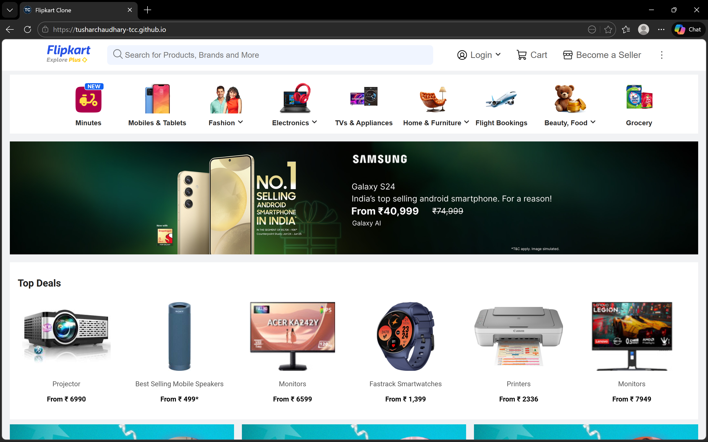
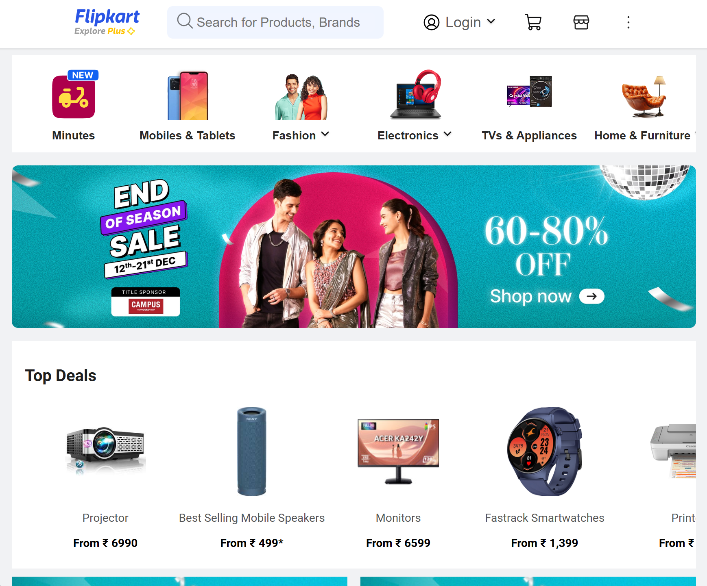
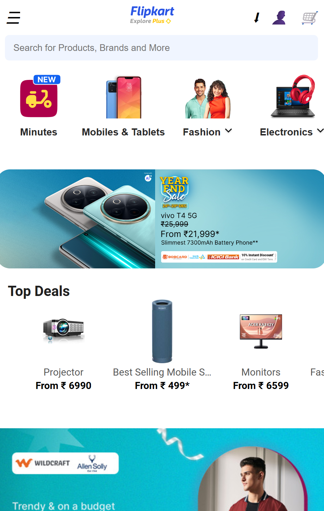

# 🛒 Flipkart Clone – Responsive E-Commerce Website

A fully responsive e-commerce website inspired by Flipkart, built using **HTML & CSS**.
This project focuses on clean UI, responsiveness, and real-world layout practices.

---

## 🚀 Live Demo
🔗 https://tusharchaudhary-tcc.github.io/

---

## 📌 Features
- Fully responsive (Desktop, Tablet & Mobile)
- Clean and modern UI design
- Navbar for desktop & mobile
- Product sections with cards
- Footer with social links
- Smooth layout using Flexbox & Grid

---

## 🛠️ Tech Stack
- HTML5
- CSS3
- Flexbox
- CSS Grid

---

## 📷 Screenshots

### Desktop View

### Tablet View

### Mobile View

### Footer View

---

## 🙋‍♂️ Author
**Tushar Chaudhary**  
Frontend Web Developer (Learner)

🔗 LinkedIn: https://www.linkedin.com/in/tushar-chaudhary-44bb9b383
